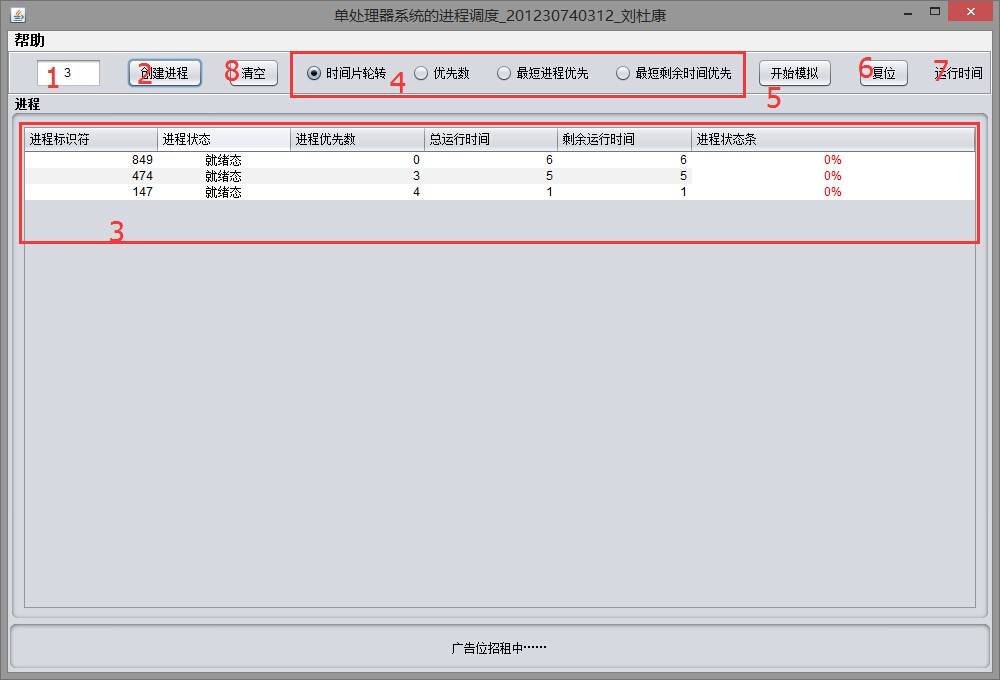
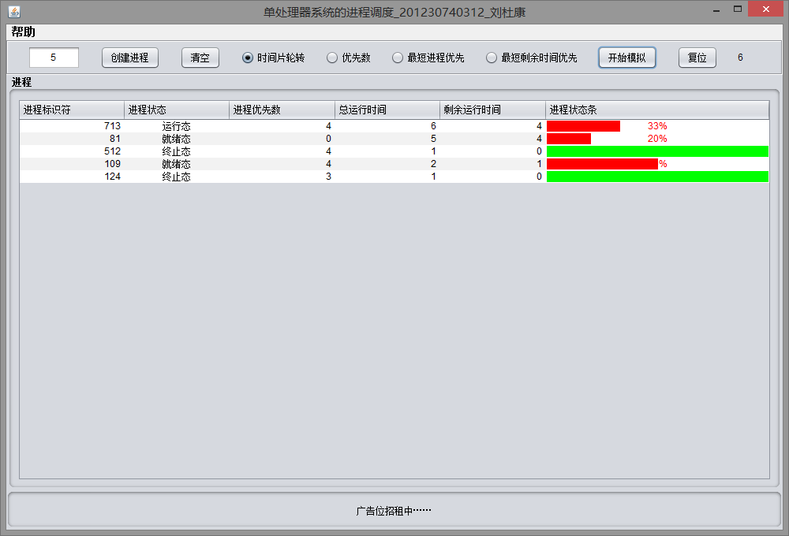
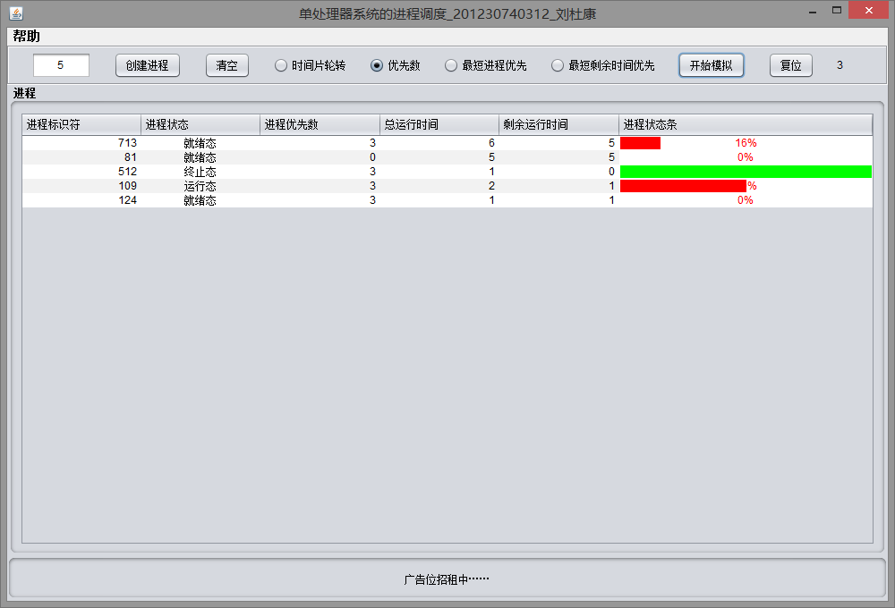
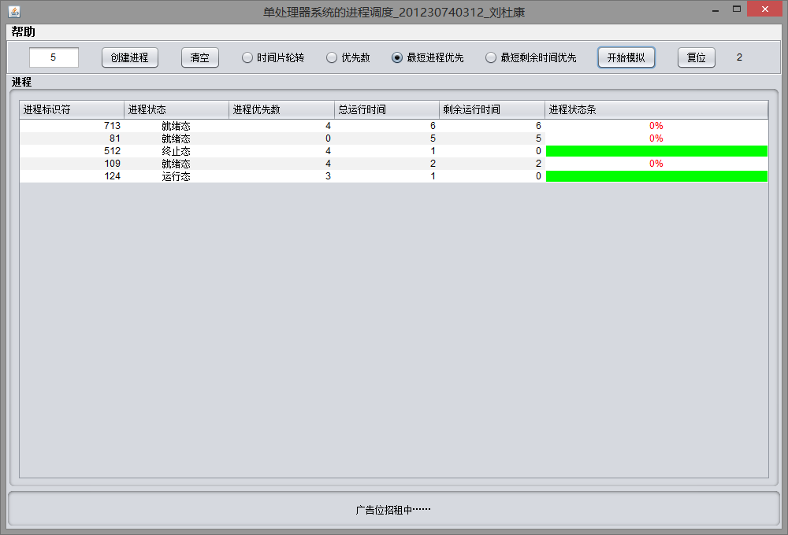
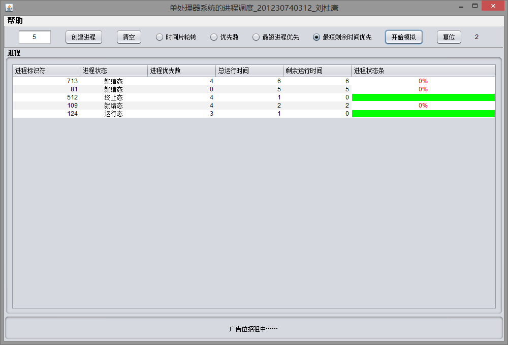

# 模拟单处理器系统的进程调度
[CSDN Jar & Doc](http://download.csdn.net/download/laudukang/8356577)

## Feature
- 实现了如下四种调度算法的模拟：
  - 时间片轮转调度
  - 优先数调度
  - 最短进程优先
  - 最短剩余时间优先

- 模拟过程使用了JProgressBar作为进程状态条，更为直观地观察到每个进程的执行状态

## Test Screenshot

用户操作指引
 
 

按时间片轮转调度
 
 

按优先数调度
 
 

按最短进程优先调度
 
 

按最短剩余时间优先调度
